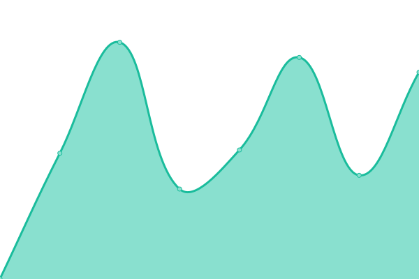
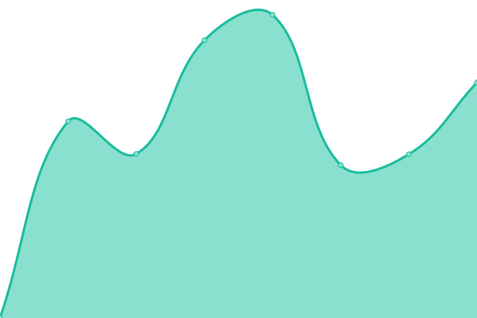
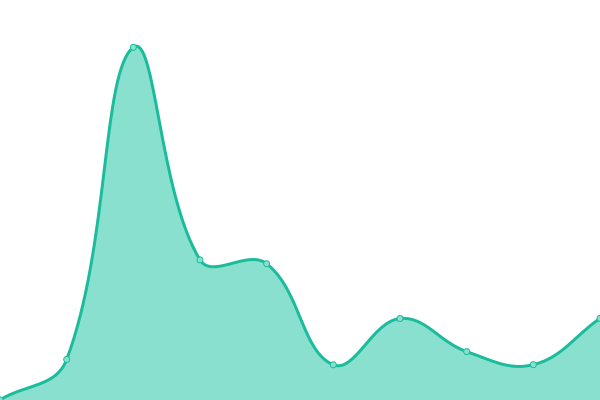
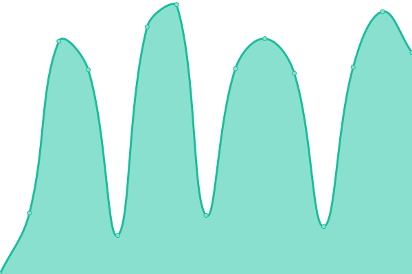
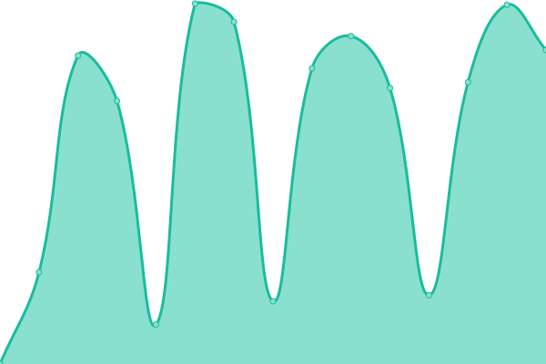
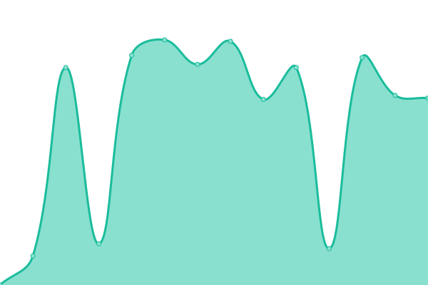
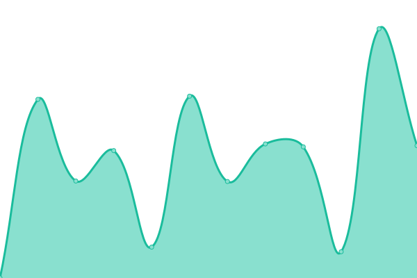
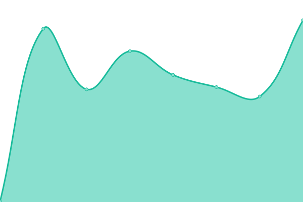

# [📈 Live Status](https://weareswitch.github.io/upptime): <!--live status--> **🟩 All systems operational**

This repository contains the open-source uptime monitor and status page for [Switch Design Consultancy](https://weareswitch.com), powered by [Upptime](https://github.com/upptime/upptime).

With [Upptime](https://upptime.js.org), you can get your own unlimited and free uptime monitor and status page, powered entirely by a GitHub repository. We use [Issues](https://github.com/weareswitch/upptime/issues) as incident reports, [Actions](https://github.com/weareswitch/upptime/actions) as uptime monitors, and [Pages](https://weareswitch.github.io/upptime) for the status page.

<!--start: status pages-->
<!-- This summary is generated by Upptime (https://github.com/upptime/upptime) -->
<!-- Do not edit this manually, your changes will be overwritten -->
<!-- prettier-ignore -->
| URL | Status | History | Response Time | Uptime |
| --- | ------ | ------- | ------------- | ------ |
|  [Switch](https://weareswitch.com) | 🟩 Up | [switch.yml](https://github.com/weareswitch/upptime/commits/HEAD/history/switch.yml) | 

 542ms
     
 | 

<a href="https://weareswitch.github.io/upptime/history/switch">99.75%</a>
    

|  [Affinity Water](https://www.affinitywater.co.uk) | 🟩 Up | [affinity-water.yml](https://github.com/weareswitch/upptime/commits/HEAD/history/affinity-water.yml) | 

 560ms
     
 | 

<a href="https://weareswitch.github.io/upptime/history/affinity-water">100.00%</a>
    

|  [JCT](https://www.jctltd.co.uk) | 🟩 Up | [jct.yml](https://github.com/weareswitch/upptime/commits/HEAD/history/jct.yml) | 

 948ms
     
 | 

<a href="https://weareswitch.github.io/upptime/history/jct">100.00%</a>
    

|  [JCT Corporate](https://corporate.jctltd.co.uk) | 🟩 Up | [jct-corporate.yml](https://github.com/weareswitch/upptime/commits/HEAD/history/jct-corporate.yml) | 

 679ms
     
 | 

<a href="https://weareswitch.github.io/upptime/history/jct-corporate">100.00%</a>
    

|  [JCT YPG](https://ypg.jctltd.co.uk) | 🟩 Up | [jct-ypg.yml](https://github.com/weareswitch/upptime/commits/HEAD/history/jct-ypg.yml) | 

 661ms
     
 | 

<a href="https://weareswitch.github.io/upptime/history/jct-ypg">100.00%</a>
    

|  [Build UK](https://builduk.org) | 🟩 Up | [build-uk.yml](https://github.com/weareswitch/upptime/commits/HEAD/history/build-uk.yml) | 

 706ms
     
 | 

<a href="https://weareswitch.github.io/upptime/history/build-uk">99.76%</a>
    

|  [Open Doors](https://opendoors.construction) | 🟩 Up | [open-doors.yml](https://github.com/weareswitch/upptime/commits/HEAD/history/open-doors.yml) | 

 1226ms
     
 | 

<a href="https://weareswitch.github.io/upptime/history/open-doors">99.77%</a>
    

|  [Middle Level](https://middlelevel.gov.uk) | 🟩 Up | [middle-level.yml](https://github.com/weareswitch/upptime/commits/HEAD/history/middle-level.yml) | 

 842ms
     
 | 

<a href="https://weareswitch.github.io/upptime/history/middle-level">100.00%</a>
    

|  [KitAid](https://kitaid.net) | 🟩 Up | [kit-aid.yml](https://github.com/weareswitch/upptime/commits/HEAD/history/kit-aid.yml) | 

 736ms
     
 | 

<a href="https://weareswitch.github.io/upptime/history/kit-aid">100.00%</a>
    

|  [McDermotts](https://www.mcdermotts.co.uk) | 🟩 Up | [mc-dermotts.yml](https://github.com/weareswitch/upptime/commits/HEAD/history/mc-dermotts.yml) | 

 846ms
     
 | 

<a href="https://weareswitch.github.io/upptime/history/mc-dermotts">100.00%</a>
    

|  [INCA](https://www.inca-ltd.org.uk) | 🟩 Up | [inca.yml](https://github.com/weareswitch/upptime/commits/HEAD/history/inca.yml) | 

 529ms
     
 | 

<a href="https://weareswitch.github.io/upptime/history/inca">100.00%</a>
    

|  [Withers & Rogers](https://www.withersrogers.com) | 🟩 Up | [withers-and-rogers.yml](https://github.com/weareswitch/upptime/commits/HEAD/history/withers-and-rogers.yml) | 

 1777ms
     
 | 

<a href="https://weareswitch.github.io/upptime/history/withers-and-rogers">97.15%</a>
    

|  [Withers & Rogers France](https://www.withersrogers.fr) | 🟩 Up | [withers-and-rogers-france.yml](https://github.com/weareswitch/upptime/commits/HEAD/history/withers-and-rogers-france.yml) | 

 1681ms
     
 | 

<a href="https://weareswitch.github.io/upptime/history/withers-and-rogers-france">97.89%</a>
    

|  [Withers & Rogers Germany](https://www.withersrogers.de) | 🟩 Up | [withers-and-rogers-germany.yml](https://github.com/weareswitch/upptime/commits/HEAD/history/withers-and-rogers-germany.yml) | 

 1734ms
     
 | 

<a href="https://weareswitch.github.io/upptime/history/withers-and-rogers-germany">97.14%</a>
    

|  [Withers & Rogers Renewals](https://www.wrrenewals.com) | 🟩 Up | [withers-and-rogers-renewals.yml](https://github.com/weareswitch/upptime/commits/HEAD/history/withers-and-rogers-renewals.yml) | 

 2215ms
     
 | 

<a href="https://weareswitch.github.io/upptime/history/withers-and-rogers-renewals">100.00%</a>
    

|  [Screen4](https://screen4academy.org) | 🟩 Up | [screen4.yml](https://github.com/weareswitch/upptime/commits/HEAD/history/screen4.yml) | 

 675ms
     
 | 

<a href="https://weareswitch.github.io/upptime/history/screen4">100.00%</a>
    

|  [Balls & Boots](https://ballsandboots.org) | 🟩 Up | [balls-and-boots.yml](https://github.com/weareswitch/upptime/commits/HEAD/history/balls-and-boots.yml) | 

 454ms
     
 | 

<a href="https://weareswitch.github.io/upptime/history/balls-and-boots">100.00%</a>
    

<!--end: status pages-->

[**Visit our status website →**](https://weareswitch.github.io/upptime)

## 📄 License

- Powered by: [Upptime](https://github.com/upptime/upptime)
- Code: [MIT](./LICENSE) © [Anand Chowdhary](https://anandchowdhary.com), supported by [Pabio](https://pabio.com)
- Data in the `./history` directory: [Open Database License](https://opendatacommons.org/licenses/odbl/1-0/)
