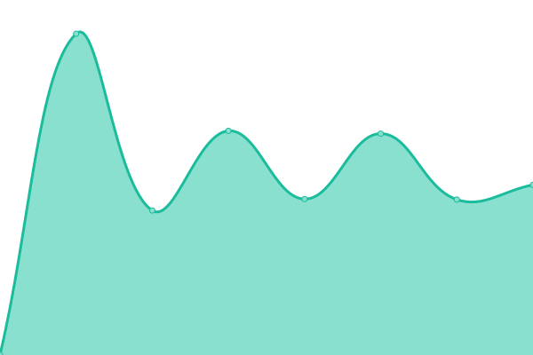
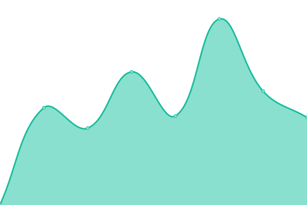
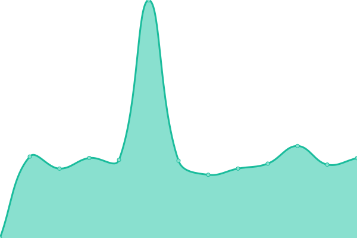

# [📈 Live Status](https://weareswitch.github.io/upptime): <!--live status--> **🟧 Partial outage**

This repository contains the open-source uptime monitor and status page for [Switch Design Consultancy](https://weareswitch.com), powered by [Upptime](https://github.com/upptime/upptime).

With [Upptime](https://upptime.js.org), you can get your own unlimited and free uptime monitor and status page, powered entirely by a GitHub repository. We use [Issues](https://github.com/weareswitch/upptime/issues) as incident reports, [Actions](https://github.com/weareswitch/upptime/actions) as uptime monitors, and [Pages](https://weareswitch.github.io/upptime) for the status page.

<!--start: status pages-->
<!-- This summary is generated by Upptime (https://github.com/upptime/upptime) -->
<!-- Do not edit this manually, your changes will be overwritten -->
<!-- prettier-ignore -->
| URL | Status | History | Response Time | Uptime |
| --- | ------ | ------- | ------------- | ------ |
|  [Switch](https://weareswitch.com) | 🟩 Up | [switch.yml](https://github.com/weareswitch/upptime/commits/HEAD/history/switch.yml) | 

 540ms
     
 | 

<a href="https://weareswitch.github.io/upptime/history/switch">100.00%</a>
    

|  [Affinity Water](https://www.affinitywater.co.uk) | 🟩 Up | [affinity-water.yml](https://github.com/weareswitch/upptime/commits/HEAD/history/affinity-water.yml) | 

 751ms
     
 | 

<a href="https://weareswitch.github.io/upptime/history/affinity-water">100.00%</a>
    

|  [JCT](https://www.jctltd.co.uk) | 🟩 Up | [jct.yml](https://github.com/weareswitch/upptime/commits/HEAD/history/jct.yml) | 

 966ms
     
 | 

<a href="https://weareswitch.github.io/upptime/history/jct">100.00%</a>
    

|  [JCT Corporate](https://corporate.jctltd.co.uk) | 🟩 Up | [jct-corporate.yml](https://github.com/weareswitch/upptime/commits/HEAD/history/jct-corporate.yml) | 

 572ms
     
 | 

<a href="https://weareswitch.github.io/upptime/history/jct-corporate">100.00%</a>
    

|  [JCT YPG](https://ypg.jctltd.co.uk) | 🟩 Up | [jct-ypg.yml](https://github.com/weareswitch/upptime/commits/HEAD/history/jct-ypg.yml) | 

 674ms
     
 | 

<a href="https://weareswitch.github.io/upptime/history/jct-ypg">100.00%</a>
    

|  [JCT dev](https://jct.switch-dev.co.uk) | 🟥 Down | [jct-dev.yml](https://github.com/weareswitch/upptime/commits/HEAD/history/jct-dev.yml) | 

 3277ms
     
 | 

<a href="https://weareswitch.github.io/upptime/history/jct-dev">58.46%</a>
    

|  [Build UK](https://builduk.org) | 🟩 Up | [build-uk.yml](https://github.com/weareswitch/upptime/commits/HEAD/history/build-uk.yml) | 

 726ms
     
 | 

<a href="https://weareswitch.github.io/upptime/history/build-uk">100.00%</a>
    

|  [SBP](https://sbp-cert.org) | 🟩 Up | [sbp.yml](https://github.com/weareswitch/upptime/commits/HEAD/history/sbp.yml) | 

 832ms
     
 | 

<a href="https://weareswitch.github.io/upptime/history/sbp">100.00%</a>
    

|  [Open Doors](https://opendoors.construction) | 🟩 Up | [open-doors.yml](https://github.com/weareswitch/upptime/commits/HEAD/history/open-doors.yml) | 

 715ms
     
 | 

<a href="https://weareswitch.github.io/upptime/history/open-doors">100.00%</a>
    

|  [Middle Level](https://middlelevel.gov.uk) | 🟩 Up | [middle-level.yml](https://github.com/weareswitch/upptime/commits/HEAD/history/middle-level.yml) | 

 893ms
     
 | 

<a href="https://weareswitch.github.io/upptime/history/middle-level">100.00%</a>
    

|  [KitAid](https://kitaid.net) | 🟩 Up | [kit-aid.yml](https://github.com/weareswitch/upptime/commits/HEAD/history/kit-aid.yml) | 

 754ms
     
 | 

<a href="https://weareswitch.github.io/upptime/history/kit-aid">100.00%</a>
    

|  [McDermotts](https://www.mcdermotts.co.uk) | 🟩 Up | [mc-dermotts.yml](https://github.com/weareswitch/upptime/commits/HEAD/history/mc-dermotts.yml) | 

 869ms
     
 | 

<a href="https://weareswitch.github.io/upptime/history/mc-dermotts">100.00%</a>
    

|  [INCA](https://www.inca-ltd.org.uk) | 🟩 Up | [inca.yml](https://github.com/weareswitch/upptime/commits/HEAD/history/inca.yml) | 

 262ms
     
 | 

<a href="https://weareswitch.github.io/upptime/history/inca">100.00%</a>
    

|  [Mila](https://www.mila.co.uk) | 🟩 Up | [mila.yml](https://github.com/weareswitch/upptime/commits/HEAD/history/mila.yml) | 

 733ms
     
 | 

<a href="https://weareswitch.github.io/upptime/history/mila">100.00%</a>
    

|  [Mila Ireland](https://www.mila.ie) | 🟩 Up | [mila-ireland.yml](https://github.com/weareswitch/upptime/commits/HEAD/history/mila-ireland.yml) | 

 601ms
     
 | 

<a href="https://weareswitch.github.io/upptime/history/mila-ireland">100.00%</a>
    

|  [Withers & Rogers](https://www.withersrogers.com) | 🟩 Up | [withers-and-rogers.yml](https://github.com/weareswitch/upptime/commits/HEAD/history/withers-and-rogers.yml) | 

 1545ms
     
 | 

<a href="https://weareswitch.github.io/upptime/history/withers-and-rogers">100.00%</a>
    

|  [Withers & Rogers France](https://www.withersrogers.fr) | 🟩 Up | [withers-and-rogers-france.yml](https://github.com/weareswitch/upptime/commits/HEAD/history/withers-and-rogers-france.yml) | 

 1628ms
     
 | 

<a href="https://weareswitch.github.io/upptime/history/withers-and-rogers-france">100.00%</a>
    

|  [Withers & Rogers Germany](https://www.withersrogers.de) | 🟩 Up | [withers-and-rogers-germany.yml](https://github.com/weareswitch/upptime/commits/HEAD/history/withers-and-rogers-germany.yml) | 

 1251ms
     
 | 

<a href="https://weareswitch.github.io/upptime/history/withers-and-rogers-germany">100.00%</a>
    

|  [Withers & Rogers Renewals](https://www.wrrenewals.com) | 🟩 Up | [withers-and-rogers-renewals.yml](https://github.com/weareswitch/upptime/commits/HEAD/history/withers-and-rogers-renewals.yml) | 

 1351ms
     
 | 

<a href="https://weareswitch.github.io/upptime/history/withers-and-rogers-renewals">100.00%</a>
    

|  [Screen4](https://screen4academy.org) | 🟩 Up | [screen4.yml](https://github.com/weareswitch/upptime/commits/HEAD/history/screen4.yml) | 

 696ms
     
 | 

<a href="https://weareswitch.github.io/upptime/history/screen4">100.00%</a>
    

|  [Balls & Boots](https://ballsandboots.org) | 🟩 Up | [balls-and-boots.yml](https://github.com/weareswitch/upptime/commits/HEAD/history/balls-and-boots.yml) | 

 366ms
     
 | 

<a href="https://weareswitch.github.io/upptime/history/balls-and-boots">100.00%</a>
    

|  [Twistub](https://www.twistub.co.uk) | 🟩 Up | [twistub.yml](https://github.com/weareswitch/upptime/commits/HEAD/history/twistub.yml) | 

 495ms
     
 | 

<a href="https://weareswitch.github.io/upptime/history/twistub">100.00%</a>
    

<!--end: status pages-->

[**Visit our status website →**](https://weareswitch.github.io/upptime)

## 📄 License

- Powered by: [Upptime](https://github.com/upptime/upptime)
- Code: [MIT](./LICENSE) © [Anand Chowdhary](https://anandchowdhary.com), supported by [Pabio](https://pabio.com)
- Data in the `./history` directory: [Open Database License](https://opendatacommons.org/licenses/odbl/1-0/)
